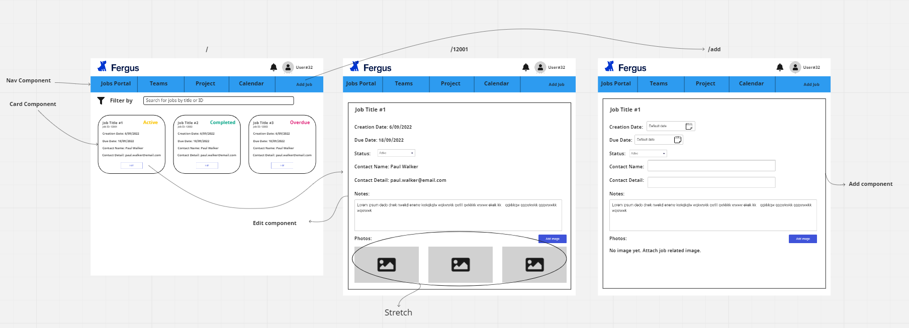

### To run Fergus Technical Test

- Firstly mock database by running the following commands:
- npm i
- npm run knex migrate:latest
- npm run knex seed: run
- npm run dev to start running the server.
- Server route is located at localhost:3000/

### To reset database, do the following in CLI:
- npm run knex migrate:latest
- npm run knex seed:run

### Page Tip:
- Click on Dashboard option in Nav bar to return back to home job page
- Other options in top nav bar does not work

### Stetch:
- Add photo attachments

### Just for fun (storyboard before starting):

